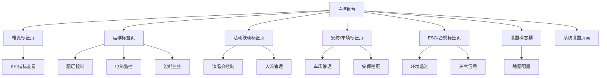

# Runway 1331 智慧物业管理系统产品需求文档

## 1. 产品概述

Runway 1331 智慧物业管理系统是一个基于地图可视化的综合性物业管理平台，集成了实时监控、设备管理、安防控制、环境监测和应急响应等核心功能。

系统主要解决大型商业综合体的运营管理复杂性问题，为物业管理人员提供统一的可视化控制台，实现对建筑设施、人员流动、环境状况和安全事件的实时监控和智能管理。

目标是打造香港地区领先的智慧物业管理解决方案，提升运营效率，降低管理成本，增强安全保障。

## 2. 核心功能

### 2.1 用户角色

| 角色    | 登录方式   | 核心权限                  |
| ----- | ------ | --------------------- |
| 物业管理员 | 账号密码登录 | 查看所有数据、控制设备、处理事件、生成报告 |
| 安保人员  | 账号密码登录 | 查看安防数据、控制门禁车闸、处理安全事件  |
| 维护人员  | 账号密码登录 | 查看设备状态、更新维护记录、接收工单    |
| 访客用户  | 无需登录   | 仅查看公开信息（天气、基本状态）      |

### 2.2 功能模块

系统包含以下核心页面：

1. **主控制台页面**：全屏地图视图、实时数据面板、多标签页控制抽屉
2. **系统设置页面**：地图配置、用户管理、系统参数设置

### 2.3 页面详情

| 页面名称 | 模块名称      | 功能描述                                                                                     |
| ---- | --------- | ---------------------------------------------------------------------------------------- |
| 主控制台 | 顶部状态栏     | 显示系统状态（Live/离线）、信号强度、当前日期、一键演示、场景模式切换（演唱会模式、T8模式）、设置入口                                   |
| 主控制台 | 全屏地图      | 基于Mapbox的3D地图显示、多图层控制（设备点位、人流热力、CCTV、穿梭巴士、演唱会散场人流、IAQ空气质量、垃圾桶清运、内涝风险、安保巡更）、实时动画效果、点击交互弹窗 |
| 主控制台 | 右侧控制抽屉    | 包含五个标签页的控制面板，支持展开/收起，实时数据展示和操作控制                                                         |
| 主控制台 | 概览标签页     | 今日用电量、用水量、车场空置率、舒适度（IAQ）指标；维保事件和工单统计；系统状态概览                                              |
| 主控制台 | 运维标签页     | 地图图层开关控制；电梯群控状态（6部电梯的楼层、方向、状态显示）；能耗看板（实时用电用水数据图表）                                        |
| 主控制台 | 活动联动标签页   | 演唱会观众预估（28k人）；散场控制（开始/停止按钮）；路径分流策略；穿梭巴士控制（启用/停止）；进站速度、出租车候客、抵达人数、疏散时间等KPI指标              |
| 主控制台 | 安防/车场标签页  | 车场ANPR系统（入场/出场车流统计、车闸状态、黑名单识别、开闸/关闸控制、ANPR日志列表）；安保巡更（巡更路线控制、开始/停止按钮）                     |
| 主控制台 | ESG/合规标签页 | IAQ等级显示；噪声管制状态；垃圾清运回收占比；天气信号控制（正常、T1、T3、T8、T10、Amber、Red、Black等级按钮）                      |
| 主控制台 | 底部跑马灯     | 实时警报信息滚动显示；系统状态图例（正常/绿色、预警/橙色、告警/红色）                                                     |
| 主控制台 | 设置模态框     | Mapbox Access Token配置；3D Tiles URL设置；重新初始化地图；加载3D模型                                      |
| 系统设置 | 用户管理      | 用户账号管理、权限分配、登录日志                                                                         |
| 系统设置 | 系统配置      | 地图参数、数据源配置、告警阈值设置                                                                        |
| 系统设置 | 数据导出      | 历史数据导出、报告生成、日志下载                                                                         |

## 3. 核心流程

### 3.1 物业管理员操作流程

1. 登录系统进入主控制台
2. 查看概览标签页了解整体状况
3. 根据需要切换到不同标签页进行专项管理
4. 使用地图图层控制查看特定设备或区域
5. 处理告警事件和维护工单
6. 生成运营报告

### 3.2 应急响应流程

1. 系统检测到异常事件（如天气警报、设备故障）
2. 自动触发相应的应急模式（如T8台风模式）
3. 系统自动调整相关设施状态（关闭活动联动、显示风险区域）
4. 管理员接收告警通知
5. 执行应急处置措施
6. 记录处置过程和结果

### 3.3 演唱会模式操作流程

1. 管理员点击"演唱会模式"按钮
2. 系统切换到活动联动标签页
3. 启动人流疏散动画和穿梭巴士服务
4. 实时监控观众流量和疏散进度
5. 根据需要调整分流策略
6. 活动结束后关闭相关功能

## 4. 用户界面设计

### 4.1 设计风格

* **主色调**：深色主题（#0b0d12背景），科技蓝（#3b82f6）作为主要强调色

* **辅助色彩**：绿色（#22c55e）表示正常状态，橙色（#f59e0b）表示预警，红色（#ef4444）表示告警

* **按钮样式**：圆角矩形按钮，支持悬停和点击状态变化

* **字体**：系统默认字体，标题使用16-18px，正文使用14px，小字使用12px

* **布局风格**：全屏布局，左侧地图主体，右侧抽屉式控制面板，顶部状态栏，底部跑马灯

* **图标风格**：线性图标，简洁现代，与Mapbox地图风格保持一致

### 4.2 页面设计概览

| 页面名称  | 模块名称  | UI元素                                                      |
| ----- | ----- | --------------------------------------------------------- |
| 主控制台  | 顶部状态栏 | 深色背景（#1f2937），白色文字，状态指示灯（绿色圆点），按钮采用蓝色背景（#3b82f6），圆角8px    |
| 主控制台  | 全屏地图  | Mapbox暗色地图样式，自定义图层使用半透明色彩，弹窗采用白色背景，阴影效果                   |
| 主控制台  | 控制抽屉  | 半透明深色背景（rgba(15, 23, 42, 0.95)），白色文字，标签页采用下划线激活状态，卡片式内容布局 |
| 主控制台  | 数据卡片  | 白色背景，圆角12px，阴影效果，数值使用大字体（24px），单位使用小字体（12px）              |
| 主控制台  | 控制按钮  | 蓝色主按钮（#3b82f6），绿色成功按钮（#22c55e），红色危险按钮（#ef4444），圆角6px      |
| 主控制台  | 状态指示器 | 圆形指示灯，直径8px，绿色/橙色/红色状态色彩                                  |
| 主控制台  | 数据列表  | 斑马纹背景，悬停高亮效果，操作按钮右对齐                                      |
| 主控制台  | 跑马灯   | 深色背景（#374151），黄色文字（#fbbf24），从右到左滚动动画                      |
| 设置模态框 | 表单元素  | 白色背景，输入框采用边框样式，标签文字左对齐，按钮组右对齐                             |

### 4.3 响应式设计

系统采用桌面优先设计，针对大屏幕显示器优化（推荐1920x1080及以上分辨率）。

* **桌面端（≥1200px）**：全功能显示，右侧抽屉固定宽度400px

* **平板端（768px-1199px）**：抽屉可收起，地图占据更多空间

* **移动端（<768px）**：抽屉改为底部弹出，简化部分功能显示

支持触摸操作优化，按钮最小点击区域44px，支持手势缩放和平移地图。

## 5. 技术要求

### 5.1 性能要求

* 页面加载时间不超过3秒

* 地图渲染帧率保持在30fps以上

* 实时数据更新延迟不超过2秒

* 支持同时显示1000+地图标点

* 动画流畅度60fps

### 5.2 兼容性要求

* 支持Chrome 90+、Firefox 88+、Safari 14+、Edge 90+

* 支持WebGL 2.0

* 支持ES2020语法

* 移动端支持iOS 14+、Android 10+

### 5.3 安全要求

* 用户身份认证和权限控制

* 敏感数据加密传输

* 操作日志记录

* 防止XSS和CSRF攻击

### 5.4 可用性要求

* 系统可用性99.5%以上

* 支持7x24小时运行

* 具备故障自动恢复能力

* 提供完整的错误处理和用户提示

## 6. 数据要求

### 6.1 实时数据

* KPI指标：用电量、用水量、车场空置率、舒适度指数

* 设备状态：电梯状态、传感器数据、CCTV状态

* 人员流动：实时人流数据、车辆进出记录

* 环境数据：温度、湿度、空气质量、噪音等级

### 6.2 历史数据

* 至少保存1年的历史运营数据

* 支持按日、周、月、年的数据统计

* 提供数据导出功能

* 支持趋势分析和对比

### 6.3 地图数据

* 基础地图：Mapbox卫星图和街道图

* 建筑模型：3D Tiles格式的建筑物模型

* 设施标点：传感器、摄像头、设备位置信息

* 区域划分：功能区域、风险区域、管理边界

## 7. 集成要求

### 7.1 外部系统集成

* 楼宇自控系统（BAS）

* 安防监控系统（CCTV）

* 门禁车闸系统

* 消防报警系统

* 天气预报服务

### 7.2 数据接口

* RESTful API接口

* WebSocket实时数据推送

* 标准化数据格式（JSON）

* 支持数据验证和错误处理

## 8. 部署要求

### 8.1 服务器要求

* CPU：8核心以上

* 内存：16GB以上

* 存储：SSD 500GB以上

* 网络：千兆网络接入

### 8.2 软件环境

* 操作系统：Linux Ubuntu 20.04+

* Web服务器：Nginx

* 数据库：PostgreSQL 13+

* 缓存：Redis 6+

### 8.3 备份和恢复

* 数据库每日自动备份

* 系统配置文件版本控制

* 支持快速恢复和回滚

* 异地备份存储

## 9. 测试要求

### 9.1 功能测试

* 所有功能模块的完整测试

* 用户权限和安全测试

* 数据准确性验证

* 异常情况处理测试

### 9.2 性能测试

* 负载测试（100并发用户）

* 压力测试（峰值负载）

* 地图渲染性能测试

* 内存泄漏检测

### 9.3 兼容性测试

* 多浏览器兼容性测试

* 不同分辨率适配测试

* 移动设备兼容性测试

* 网络环境适应性测试

## 10. 维护要求

### 10.1 系统监控

* 实时系统状态监控

* 性能指标监控

* 错误日志监控

* 用户行为分析

### 10.2 更新维护

* 支持在线更新

* 版本回滚机制

* 配置热更新

* 定期安全补丁

### 10.3 技术支持

* 7x24小时技术支持

* 远程诊断和维护

* 用户培训和文档

* 定期系统优化建议

