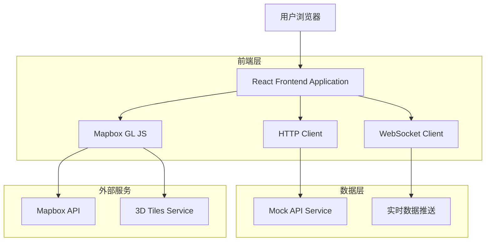
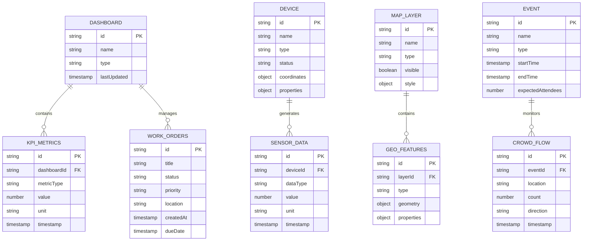

# Runway 1331 智慧物業中控系统 - 技术架构文档

## 1. Architecture design



## 2. Technology Description

* Frontend: React\@18 + TypeScript\@5 + Vite\@5 + TailwindCSS\@3

* 地图服务: Mapbox GL JS\@3.14.0 + @lets-fiware/mapbox-3dtiles\@1.0.1

* 状态管理: Zustand\@4

* 路由管理: React Router\@6

* 样式方案: TailwindCSS + CSS Modules (Less)

* 构建工具: Vite + TypeScript

* 包管理: pnpm

## 3. Route definitions

| Route       | Purpose               |
| ----------- | --------------------- |
| /           | 主控制台页面，包含地图可视化和所有功能模块 |
| /overview   | 概览仪表板，显示KPI指标和工单信息    |
| /operations | 运维管理页面，设备监控和电梯群控      |
| /events     | 活动联动页面，演唱会模式和人流管理     |
| /security   | 安防车场页面，ANPR和巡更管理      |
| /esg        | ESG合规页面，环境监测和天气预警     |
| /settings   | 系统设置页面，配置管理           |

## 4. API definitions

### 4.1 Core API

实时数据获取

```
GET /api/dashboard/kpi
```

Response:

| Param Name  | Param Type | Description |
| ----------- | ---------- | ----------- |
| electricity | number     | 今日用电量 (kWh) |
| water       | number     | 今日用水量 (m³)  |
| parking     | number     | 车场空置率 (%)   |
| comfort     | string     | 舒适度等级       |
| timestamp   | string     | 数据时间戳       |

Example

```json
{
  "electricity": 1250.5,
  "water": 89.2,
  "parking": 23.5,
  "comfort": "良好",
  "timestamp": "2024-01-15T10:30:00Z"
}
```

设备状态控制

```
POST /api/devices/control
```

Request:

| Param Name | Param Type | isRequired | Description          |
| ---------- | ---------- | ---------- | -------------------- |
| deviceId   | string     | true       | 设备ID                 |
| action     | string     | true       | 操作类型 (on/off/toggle) |
| parameters | object     | false      | 额外参数                 |

Response:

| Param Name   | Param Type | Description |
| ------------ | ---------- | ----------- |
| success      | boolean    | 操作是否成功      |
| message      | string     | 响应消息        |
| deviceStatus | object     | 设备当前状态      |

地图图层数据

```
GET /api/map/layers/{layerType}
```

Response:

| Param Name | Param Type | Description |
| ---------- | ---------- | ----------- |
| type       | string     | GeoJSON类型   |
| features   | array      | 地理要素数组      |

Example

```json
{
  "type": "FeatureCollection",
  "features": [
    {
      "type": "Feature",
      "properties": {
        "id": "S1001",
        "type": "電錶",
        "status": "綠",
        "value": 85
      },
      "geometry": {
        "type": "Point",
        "coordinates": [114.1973, 22.3223]
      }
    }
  ]
}
```

## 5. Server architecture diagram

```mermaid
graph TD
    A[React Components] --> B[Custom Hooks Layer]
    B --> C[Store Management (Zustand)]
    B --> D[API Service Layer]
    D --> E[HTTP Client]
    D --> F[WebSocket Client]
    D --> G[Mapbox Service]
    
    subgraph "前端架构层次"
        A
        B
        C
        D
    end
    
    subgraph "通信层"
        E
        F
        G
    end
```

## 6. Data model

### 6.1 Data model definition



### 6.2 Data Definition Language

由于采用前端架构，数据主要通过TypeScript接口定义和本地状态管理：

```typescript
// 核心数据类型定义
interface DashboardKPI {
  id: string;
  electricity: number; // kWh
  water: number; // m³
  parking: number; // %
  comfort: string;
  timestamp: string;
}

interface WorkOrder {
  id: string;
  title: string;
  status: 'pending' | 'in-progress' | 'completed' | 'urgent';
  priority: 'low' | 'medium' | 'high' | 'urgent';
  location: string;
  createdAt: string;
  dueDate: string;
}

interface Device {
  id: string;
  name: string;
  type: 'electricity' | 'water' | 'smoke' | 'access' | 'cctv';
  status: 'green' | 'orange' | 'red';
  coordinates: [number, number];
  properties: Record<string, any>;
}

interface MapLayer {
  id: string;
  name: string;
  type: 'sensors' | 'heatmap' | 'cctv' | 'bus' | 'flow' | 'fence' | 'iaq' | 'bins' | 'flood' | 'patrol';
  visible: boolean;
  data: GeoJSON.FeatureCollection;
}

interface ElevatorStatus {
  id: string;
  floor: string;
  direction: 'up' | 'down' | 'idle';
  status: 'normal' | 'maintenance' | 'peak-mode';
}

interface WeatherSignal {
  current: 'NORMAL' | 'T1' | 'T3' | 'T8' | 'T10' | 'Amber' | 'Red' | 'Black';
  timestamp: string;
  autoTrigger: boolean;
}

interface CrowdFlowMetrics {
  mtrSpeed: number; // 人/分钟
  taxiQueue: number; // 人
  runwayArrivals: number; // 人
  avgEvacTime: number; // 分钟
}

interface ANPRData {
  inFlow: number; // 辆/分钟
  outFlow: number; // 辆/分钟
  gateStatus: 'OPEN' | 'CLOSED';
  blacklistDetections: number;
  logs: Array<{
    timestamp: string;
    plateNumber: string;
    action: 'entry' | 'exit';
    status: 'normal' | 'blacklist';
  }>;
}
```

初始化数据和状态管理通过Zustand store实现：

```typescript
// 全局状态存储
interface AppState {
  // Dashboard状态
  kpiData: DashboardKPI | null;
  workOrders: WorkOrder[];
  
  // 地图状态
  mapLayers: Record<string, MapLayer>;
  mapReady: boolean;
  
  // 设备状态
  elevators: ElevatorStatus[];
  weatherSignal: WeatherSignal;
  
  // 活动状态
  concertMode: boolean;
  crowdFlow: CrowdFlowMetrics;
  
  // 安防状态
  anprData: ANPRData;
  patrolActive: boolean;
  
  // 操作方法
  updateKPI: (data: DashboardKPI) => void;
  toggleLayer: (layerId: string) => void;
  setWeatherSignal: (signal: string) => void;
  controlGate: (action: 'open' | 'close') => void;
}
```

