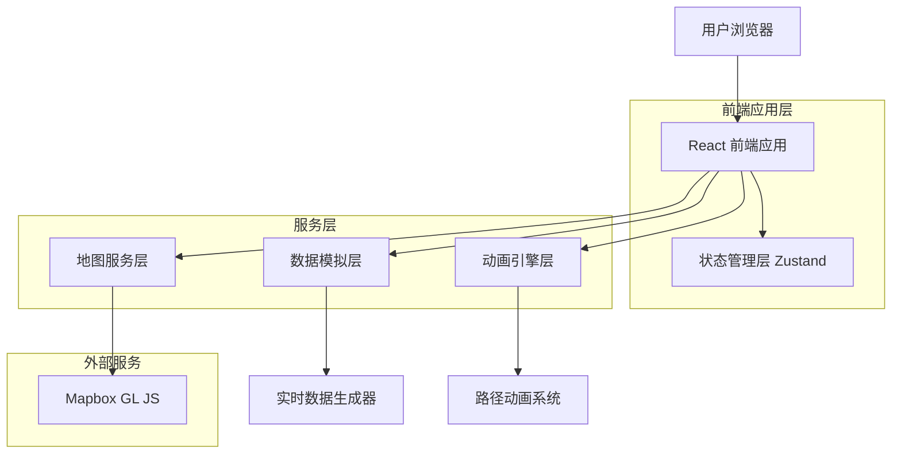
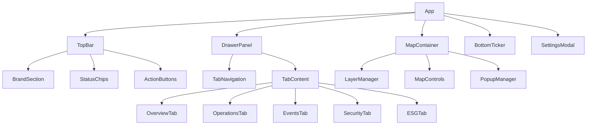
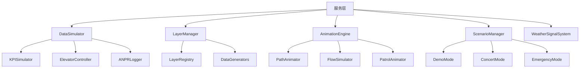

# Runway 1331 智慧物业管理系统技术架构设计文档

## 1. 架构设计



## 2. 技术描述

- **前端**: React@18 + TypeScript + Tailwind CSS + Vite
- **地图**: Mapbox GL JS@3.14.0 + @mapbox/mapbox-gl-draw
- **状态管理**: Zustand@4.4.0
- **动画**: Framer Motion@10.16.0
- **图表**: Recharts@2.8.0
- **工具库**: date-fns@2.30.0

## 3. 路由定义

| 路由 | 目的 |
|------|------|
| / | 主控制台页面，包含全屏地图和控制面板 |
| /settings | 系统设置页面（可选） |

## 4. 核心模块架构

### 4.1 组件架构



### 4.2 服务层架构



## 5. 数据模型定义

### 5.1 核心数据类型

```typescript
// KPI数据模型
interface KPIData {
  electricity: number; // 用电量 (kWh)
  water: number; // 用水量 (m³)
  parking: number; // 车场空置率 (%)
  comfort: number; // 舒适度指数
  timestamp: Date;
}

// 电梯状态模型
interface ElevatorStatus {
  id: string;
  floor: number;
  direction: '↑' | '↓' | '—';
  status: '正常' | '维保' | '高峰模式';
  lastUpdate: Date;
}

// ANPR日志模型
interface ANPRLog {
  id: string;
  timestamp: Date;
  plateNumber: string;
  action: '进场' | '出场';
  location: string;
  isBlacklisted?: boolean;
}

// 地图图层模型
interface MapLayer {
  id: string;
  name: string;
  type: 'circle' | 'symbol' | 'heatmap' | 'fill' | 'line';
  source: string;
  visible: boolean;
  data: GeoJSON.FeatureCollection;
  style: any;
}

// 传感器数据模型
interface SensorData {
  id: string;
  type: '电表' | '水表' | '烟感' | '门禁';
  location: [number, number]; // [lng, lat]
  status: '红' | '橙' | '绿';
  value: number;
  lastUpdate: Date;
}

// CCTV摄像头模型
interface CCTVCamera {
  id: string;
  name: string;
  location: [number, number];
  status: '红' | '橙' | '绿';
  snapshotUrl: string;
  isRecording: boolean;
}

// 人流数据模型
interface FlowData {
  id: string;
  path: [number, number][];
  currentPosition: [number, number];
  progress: number; // 0-1
  speed: number;
  destination: 'MTR' | 'Taxi' | 'Runway';
}

// 天气信号模型
interface WeatherSignal {
  type: 'NORMAL' | 'T1' | 'T3' | 'T8' | 'T10' | 'Amber' | 'Red' | 'Black';
  color: string;
  text: string;
  isEmergency: boolean;
}

// 场景模式模型
interface ScenarioMode {
  id: string;
  name: string;
  description: string;
  activeLayers: string[];
  animations: string[];
  weatherSignal?: string;
}
```

### 5.2 状态管理模型

```typescript
interface AppState {
  // 系统状态
  mapReady: boolean;
  currentTab: string;
  currentScenario: string;
  
  // 地图状态
  layerVisibility: Record<string, boolean>;
  mapCenter: [number, number];
  mapZoom: number;
  
  // 实时数据
  kpiData: KPIData;
  elevatorStatus: ElevatorStatus[];
  anprLogs: ANPRLog[];
  sensorData: SensorData[];
  cctvCameras: CCTVCamera[];
  
  // 动画状态
  activeAnimations: Record<string, boolean>;
  flowData: FlowData[];
  
  // 天气和场景
  weatherSignal: WeatherSignal;
  
  // 设置
  mapboxToken: string;
  tilesUrl: string;
  
  // 操作方法
  setMapReady: (ready: boolean) => void;
  switchTab: (tab: string) => void;
  toggleLayer: (layerId: string) => void;
  updateKPI: (data: KPIData) => void;
  addANPRLog: (log: ANPRLog) => void;
  updateElevatorStatus: (status: ElevatorStatus[]) => void;
  setWeatherSignal: (signal: WeatherSignal) => void;
  activateScenario: (scenarioId: string) => void;
  toggleAnimation: (animationId: string, active: boolean) => void;
}
```

## 6. 核心服务实现

### 6.1 数据模拟服务

```typescript
class DataSimulator {
  private timers: Map<string, NodeJS.Timeout> = new Map();
  private eventBus: EventEmitter;
  
  constructor(eventBus: EventEmitter) {
    this.eventBus = eventBus;
  }
  
  // 启动KPI数据模拟
  startKPISimulation(): void {
    if (this.timers.has('kpi')) return;
    
    const timer = setInterval(() => {
      const kpiData: KPIData = {
        electricity: this.randomBetween(2200, 5200),
        water: this.randomBetween(120, 480),
        parking: this.randomBetween(18, 88),
        comfort: this.randomBetween(78, 98),
        timestamp: new Date()
      };
      
      this.eventBus.emit('kpi-update', kpiData);
    }, 2200);
    
    this.timers.set('kpi', timer);
  }
  
  // 启动电梯状态模拟
  startElevatorSimulation(): void {
    if (this.timers.has('elevator')) return;
    
    const timer = setInterval(() => {
      const elevators: ElevatorStatus[] = Array.from({ length: 6 }, (_, i) => ({
        id: `L${i + 1}`,
        floor: i === 3 ? 0 : Math.floor(Math.random() * 19), // L4维保
        direction: i === 3 ? '—' : ['↑', '↓', '—'][Math.floor(Math.random() * 3)],
        status: i === 3 ? '维保' : (i === 2 ? '高峰模式' : '正常'),
        lastUpdate: new Date()
      }));
      
      this.eventBus.emit('elevator-update', elevators);
    }, 3000);
    
    this.timers.set('elevator', timer);
  }
  
  // 启动ANPR日志模拟
  startANPRSimulation(): void {
    if (this.timers.has('anpr')) return;
    
    const timer = setInterval(() => {
      if (Math.random() > 0.6) {
        const log: ANPRLog = {
          id: `anpr_${Date.now()}`,
          timestamp: new Date(),
          plateNumber: this.generatePlateNumber(),
          action: Math.random() > 0.7 ? '出场' : '进场',
          location: 'Main Gate',
          isBlacklisted: Math.random() > 0.95
        };
        
        this.eventBus.emit('anpr-log', log);
      }
    }, 2200);
    
    this.timers.set('anpr', timer);
  }
  
  private generatePlateNumber(): string {
    const prefixes = ['XX', 'HK', 'VR', 'CN'];
    const prefix = prefixes[Math.floor(Math.random() * prefixes.length)];
    const number = Math.floor(Math.random() * 9000) + 1000;
    return `${prefix}-${number}`;
  }
  
  private randomBetween(min: number, max: number): number {
    return Math.round(Math.random() * (max - min) + min);
  }
  
  // 停止所有模拟
  stopAll(): void {
    this.timers.forEach((timer, key) => {
      clearInterval(timer);
      this.timers.delete(key);
    });
  }
  
  // 停止特定模拟
  stop(type: string): void {
    const timer = this.timers.get(type);
    if (timer) {
      clearInterval(timer);
      this.timers.delete(type);
    }
  }
}
```

### 6.2 地图图层管理服务

```typescript
class LayerManager {
  private map: mapboxgl.Map;
  private layers: Map<string, MapLayer> = new Map();
  private dataSources: Map<string, any> = new Map();
  
  constructor(map: mapboxgl.Map) {
    this.map = map;
    this.initializeDataSources();
  }
  
  private initializeDataSources(): void {
    // 初始化各种数据源
    const sources = {
      'sensors-src': this.generateSensorsData(),
      'cctv-src': this.generateCCTVData(),
      'heat-src': this.generateHeatmapData(),
      'flow-src': { type: 'FeatureCollection', features: [] },
      'bus-src': { type: 'FeatureCollection', features: [] },
      'patrol-src': { type: 'FeatureCollection', features: [] },
      'iaq-src': this.generateIAQData(),
      'bins-src': this.generateBinsData(),
      'flood-src': this.generateFloodData(),
      'fence-src': this.generateFenceData()
    };
    
    Object.entries(sources).forEach(([id, data]) => {
      this.map.addSource(id, {
        type: 'geojson',
        data: data
      });
      this.dataSources.set(id, data);
    });
  }
  
  // 添加图层
  addLayer(layerConfig: any): void {
    this.map.addLayer(layerConfig);
    
    // 添加点击事件处理
    if (layerConfig.type === 'symbol' || layerConfig.type === 'circle') {
      this.map.on('click', layerConfig.id, (e) => {
        this.handleLayerClick(layerConfig.id, e);
      });
    }
  }
  
  // 初始化所有图层
  initializeLayers(): void {
    // 传感器图层
    this.addLayer({
      id: 'sensors-layer',
      type: 'circle',
      source: 'sensors-src',
      paint: {
        'circle-radius': 6,
        'circle-color': [
          'match',
          ['get', 'status'],
          '红', '#ef4444',
          '橙', '#f59e0b',
          '#22c55e'
        ],
        'circle-stroke-color': '#0b0d12',
        'circle-stroke-width': 1
      }
    });
    
    // CCTV图层
    this.addLayer({
      id: 'cctv-layer',
      type: 'symbol',
      source: 'cctv-src',
      layout: {
        'icon-image': 'camera-15',
        'icon-size': 1.1,
        'text-field': ['get', 'name'],
        'text-offset': [0, 1.1],
        'text-size': 11,
        'text-anchor': 'top'
      },
      paint: {
        'text-halo-color': '#0b0d12',
        'text-halo-width': 1.2,
        'text-color': '#e5e7eb'
      }
    });
    
    // 热力图图层
    this.addLayer({
      id: 'heat-layer',
      type: 'heatmap',
      source: 'heat-src',
      layout: { 'visibility': 'none' },
      paint: {
        'heatmap-intensity': 1.1,
        'heatmap-weight': ['coalesce', ['get', 'weight'], 0.5],
        'heatmap-radius': [
          'interpolate',
          ['linear'],
          ['zoom'],
          10, 24,
          16, 42
        ],
        'heatmap-opacity': 0.85,
        'heatmap-color': [
          'interpolate',
          ['linear'],
          ['heatmap-density'],
          0, 'rgba(0,0,255,0)',
          0.2, 'rgba(0,128,255,0.7)',
          0.4, 'rgba(0,255,255,0.8)',
          0.6, 'rgba(0,255,0,0.85)',
          0.8, 'rgba(255,255,0,0.9)',
          1, 'rgba(255,0,0,0.95)'
        ]
      }
    });
    
    // 其他图层...
  }
  
  // 切换图层可见性
  toggleLayerVisibility(layerId: string): void {
    const visibility = this.map.getLayoutProperty(layerId, 'visibility');
    const newVisibility = visibility === 'visible' ? 'none' : 'visible';
    this.map.setLayoutProperty(layerId, 'visibility', newVisibility);
  }
  
  // 更新图层数据
  updateLayerData(sourceId: string, data: any): void {
    const source = this.map.getSource(sourceId) as mapboxgl.GeoJSONSource;
    if (source) {
      source.setData(data);
      this.dataSources.set(sourceId, data);
    }
  }
  
  // 处理图层点击事件
  private handleLayerClick(layerId: string, e: mapboxgl.MapMouseEvent): void {
    const feature = e.features?.[0];
    if (!feature) return;
    
    const properties = feature.properties;
    let popupContent = '';
    
    switch (layerId) {
      case 'sensors-layer':
        popupContent = `
          <div class="popup-content">
            <h3>${properties.type}（${properties.id}）</h3>
            <p>状态：<span class="status-${properties.status}">${properties.status}</span></p>
            <p>数值：${properties.value}</p>
          </div>
        `;
        break;
      case 'cctv-layer':
        popupContent = `
          <div class="popup-content">
            <h3>${properties.name}</h3>
            <p>状态：<span class="status-${properties.status}">${properties.status}</span></p>
            
          </div>
        `;
        break;
      // 其他图层的处理...
    }
    
    if (popupContent) {
      new mapboxgl.Popup()
        .setLngLat(e.lngLat)
        .setHTML(popupContent)
        .addTo(this.map);
    }
  }
  
  // 数据生成方法
  private generateSensorsData(): GeoJSON.FeatureCollection {
    const features = [];
    const anchors = [
      [114.19733435248456, 22.322347899895064], // KTSP
      [114.2128, 22.3074] // Runway 1331
    ];
    
    for (let i = 0; i < 72; i++) {
      const anchor = anchors[i % 2];
      features.push({
        type: 'Feature',
        properties: {
          id: `S${1000 + i}`,
          type: ['电表', '水表', '烟感', '门禁'][i % 4],
          status: i % 13 === 0 ? '红' : (i % 7 === 0 ? '橙' : '绿'),
          value: Math.round(Math.random() * 89 + 10)
        },
        geometry: {
          type: 'Point',
          coordinates: [
            anchor[0] + (Math.random() - 0.5) * 0.008,
            anchor[1] + (Math.random() - 0.5) * 0.008
          ]
        }
      });
    }
    
    return { type: 'FeatureCollection', features };
  }
  
  private generateCCTVData(): GeoJSON.FeatureCollection {
    const locations = [
      [114.19733435248456, 22.322347899895064], // KTSP
      [114.2027, 22.3293], // Mall 2 Taxi
      [114.1994, 22.3304], // Kai Tak Station
      [114.2128, 22.3074] // Runway 1331
    ];
    
    const features = locations.map((location, index) => ({
      type: 'Feature',
      properties: {
        id: `CCTV${index}`,
        name: `CCTV #${index + 1}`,
        status: ['红', '橙', '绿'][index % 3],
        snapshotUrl: `https://placehold.co/320x180?text=CCTV+${index + 1}`
      },
      geometry: {
        type: 'Point',
        coordinates: [
          location[0] + (Math.random() - 0.5) * 0.003,
          location[1] + (Math.random() - 0.5) * 0.003
        ]
      }
    }));
    
    return { type: 'FeatureCollection', features };
  }
  
  // 其他数据生成方法...
}
```

### 6.3 动画引擎服务

```typescript
class AnimationEngine {
  private animationFrames: Map<string, number> = new Map();
  private layerManager: LayerManager;
  
  constructor(layerManager: LayerManager) {
    this.layerManager = layerManager;
  }
  
  // 路径插值计算
  interpolatePath(path: [number, number][], t: number): [number, number] {
    const segments = path.length - 1;
    if (segments <= 0) return path[0];
    
    const segmentLength = 1 / segments;
    const segmentIndex = Math.min(segments - 1, Math.floor(t / segmentLength));
    const localT = (t - segmentIndex * segmentLength) / segmentLength;
    
    const start = path[segmentIndex];
    const end = path[segmentIndex + 1];
    
    return [
      start[0] + (end[0] - start[0]) * localT,
      start[1] + (end[1] - start[1]) * localT
    ];
  }
  
  // 启动人流动画
  startFlowAnimation(audienceCount: number): void {
    if (this.animationFrames.has('flow')) return;
    
    const flowData = this.generateFlowData(audienceCount);
    
    const animate = () => {
      flowData.features.forEach(feature => {
        const props = feature.properties;
        props.t += props.speed;
        if (props.t > 1) props.t = 0;
        
        const path = JSON.parse(props.path);
        feature.geometry.coordinates = this.interpolatePath(path, props.t);
      });
      
      this.layerManager.updateLayerData('flow-src', flowData);
      
      const frameId = requestAnimationFrame(animate);
      this.animationFrames.set('flow', frameId);
    };
    
    animate();
  }
  
  // 启动巡更动画
  startPatrolAnimation(): void {
    if (this.animationFrames.has('patrol')) return;
    
    const patrolRoute = [
      [114.2126, 22.3098],
      [114.2148, 22.3099],
      [114.2154, 22.3075],
      [114.2114, 22.3057],
      [114.2100, 22.3088],
      [114.2126, 22.3098]
    ];
    
    let t = 0;
    const patrolData = {
      type: 'FeatureCollection',
      features: [{
        type: 'Feature',
        properties: {},
        geometry: {
          type: 'Point',
          coordinates: patrolRoute[0]
        }
      }]
    };
    
    const animate = () => {
      t += 0.01;
      if (t > 1) t = 0;
      
      patrolData.features[0].geometry.coordinates = this.interpolatePath(patrolRoute, t);
      this.layerManager.updateLayerData('patrol-src', patrolData);
      
      const frameId = requestAnimationFrame(animate);
      this.animationFrames.set('patrol', frameId);
    };
    
    animate();
  }
  
  // 启动穿梭巴士动画
  startBusAnimation(): void {
    if (this.animationFrames.has('bus')) return;
    
    const busRoute = [
      [114.1994, 22.3304], // Kai Tak Station
      [114.19733435248456, 22.322347899895064], // KTSP
      [114.2128, 22.3074] // Runway 1331
    ];
    
    let t = 0;
    let direction = 1;
    
    const busData = {
      type: 'FeatureCollection',
      features: [{
        type: 'Feature',
        properties: {},
        geometry: {
          type: 'Point',
          coordinates: busRoute[0]
        }
      }]
    };
    
    const animate = () => {
      t += 0.01 * direction;
      if (t >= 1 || t <= 0) direction *= -1;
      
      busData.features[0].geometry.coordinates = this.interpolatePath(busRoute, t);
      this.layerManager.updateLayerData('bus-src', busData);
      
      const frameId = requestAnimationFrame(animate);
      this.animationFrames.set('bus', frameId);
    };
    
    animate();
  }
  
  // 停止动画
  stopAnimation(animationId: string): void {
    const frameId = this.animationFrames.get(animationId);
    if (frameId) {
      cancelAnimationFrame(frameId);
      this.animationFrames.delete(animationId);
      
      // 清空对应的数据源
      this.layerManager.updateLayerData(`${animationId}-src`, {
        type: 'FeatureCollection',
        features: []
      });
    }
  }
  
  // 停止所有动画
  stopAllAnimations(): void {
    this.animationFrames.forEach((frameId, animationId) => {
      this.stopAnimation(animationId);
    });
  }
  
  // 生成人流数据
  private generateFlowData(audienceCount: number): GeoJSON.FeatureCollection {
    const total = audienceCount * 1000;
    const routes = {
      mtr: [[114.19733, 22.32235], [114.2006, 22.3297], [114.1994, 22.3304]],
      taxi: [[114.19733, 22.32235], [114.2021, 22.3292], [114.2027, 22.3293]],
      runway: [[114.19733, 22.32235], [114.2055, 22.3245], [114.2128, 22.3074]]
    };
    
    const distribution = {
      mtr: Math.round(total * 0.6 / 55),
      taxi: Math.round(total * 0.25 / 55),
      runway: Math.round(total * 0.15 / 55)
    };
    
    const features = [];
    
    // 生成MTR路线人流
    for (let i = 0; i < distribution.mtr; i++) {
      features.push({
        type: 'Feature',
        properties: {
          path: JSON.stringify(routes.mtr),
          t: Math.random() * 0.2,
          speed: 0.007 + Math.random() * 0.015
        },
        geometry: {
          type: 'Point',
          coordinates: routes.mtr[0]
        }
      });
    }
    
    // 生成其他路线...
    
    return { type: 'FeatureCollection', features };
  }
}
```

### 6.4 场景管理服务

```typescript
class ScenarioManager {
  private layerManager: LayerManager;
  private animationEngine: AnimationEngine;
  private dataSimulator: DataSimulator;
  private weatherSystem: WeatherSignalSystem;
  private eventBus: EventEmitter;
  
  constructor(
    layerManager: LayerManager,
    animationEngine: AnimationEngine,
    dataSimulator: DataSimulator,
    weatherSystem: WeatherSignalSystem,
    eventBus: EventEmitter
  ) {
    this.layerManager = layerManager;
    this.animationEngine = animationEngine;
    this.dataSimulator = dataSimulator;
    this.weatherSystem = weatherSystem;
    this.eventBus = eventBus;
  }
  
  // 激活演示模式
  activateDemoMode(): void {
    // 显示所有主要图层
    const layers = ['sensors-layer', 'cctv-layer', 'heat-layer', 'fence-layer', 'iaq-layer', 'bins-layer'];
    layers.forEach(layerId => {
      this.layerManager.toggleLayerVisibility(layerId);
    });
    
    // 启动所有动画
    this.animationEngine.startBusAnimation();
    this.animationEngine.startFlowAnimation(28); // 28k观众
    this.animationEngine.startPatrolAnimation();
    
    // 启动数据模拟
    this.dataSimulator.startKPISimulation();
    this.dataSimulator.startElevatorSimulation();
    this.dataSimulator.startANPRSimulation();
    
    this.eventBus.emit('scenario-changed', 'demo');
    this.eventBus.emit('alert', '一键演示模式已启动');
  }
  
  // 激活演唱会模式
  activateConcertMode(): void {
    // 切换到活动联动标签
    this.eventBus.emit('tab-switch', 'event');
    
    // 启动人流和巴士动画
    this.animationEngine.startFlowAnimation(28);
    this.animationEngine.startBusAnimation();
    
    // 显示相关图层
    this.layerManager.toggleLayerVisibility('flow-layer');
    this.layerManager.toggleLayerVisibility('bus-layer');
    
    this.eventBus.emit('scenario-changed', 'concert');
    this.eventBus.emit('alert', '演唱会模式已启动');
  }
  
  // 激活台风模式
  activateTyphoonMode(): void {
    // 设置T8天气信号
    this.weatherSystem.setSignal('T8');
    
    // 停止活动相关功能
    this.animationEngine.stopAnimation('flow');
    this.animationEngine.stopAnimation('bus');
    
    // 显示内涝风险图层
    this.layerManager.toggleLayerVisibility('flood-layer');
    
    this.eventBus.emit('scenario-changed', 'typhoon');
    this.eventBus.emit('alert', 'T8台风模式已启动，已关闭活动联动功能');
  }
  
  // 重置到正常模式
  resetToNormalMode(): void {
    // 停止所有动画
    this.animationEngine.stopAllAnimations();
    
    // 重置天气信号
    this.weatherSystem.setSignal('NORMAL');
    
    // 隐藏所有可选图层
    const optionalLayers = ['heat-layer', 'flow-layer', 'bus-layer', 'patrol-layer', 'flood-layer', 'iaq-layer', 'bins-layer'];
    optionalLayers.forEach(layerId => {
      this.layerManager.toggleLayerVisibility(layerId);
    });
    
    this.eventBus.emit('scenario-changed', 'normal');
    this.eventBus.emit('alert', '已重置到正常模式');
  }
}
```

## 7. 性能优化策略

### 7.1 地图性能优化

```typescript
class MapPerformanceOptimizer {
  private map: mapboxgl.Map;
  private visibleLayers: Set<string> = new Set();
  
  constructor(map: mapboxgl.Map) {
    this.map = map;
    this.setupPerformanceMonitoring();
  }
  
  // 设置性能监控
  private setupPerformanceMonitoring(): void {
    this.map.on('render', () => {
      const fps = this.calculateFPS();
      if (fps < 30) {
        this.optimizePerformance();
      }
    });
  }
  
  // 动态调整图层复杂度
  private optimizePerformance(): void {
    // 减少热力图密度
    if (this.visibleLayers.has('heat-layer')) {
      this.map.setPaintProperty('heat-layer', 'heatmap-radius', [
        'interpolate',
        ['linear'],
        ['zoom'],
        10, 16, // 减少半径
        16, 28
      ]);
    }
    
    // 减少动画频率
    this.reduceAnimationFrequency();
  }
  
  // 减少动画频率
  private reduceAnimationFrequency(): void {
    // 实现动画频率控制逻辑
  }
  
  // 计算FPS
  private calculateFPS(): number {
    // 实现FPS计算逻辑
    return 60; // 占位符
  }
}
```

### 7.2 内存管理

```typescript
class MemoryManager {
  private timers: Set<NodeJS.Timeout> = new Set();
  private eventListeners: Map<string, Function[]> = new Map();
  
  // 注册定时器
  registerTimer(timer: NodeJS.Timeout): void {
    this.timers.add(timer);
  }
  
  // 注册事件监听器
  registerEventListener(event: string, listener: Function): void {
    if (!this.eventListeners.has(event)) {
      this.eventListeners.set(event, []);
    }
    this.eventListeners.get(event)!.push(listener);
  }
  
  // 清理所有资源
  cleanup(): void {
    // 清理定时器
    this.timers.forEach(timer => clearInterval(timer));
    this.timers.clear();
    
    // 清理事件监听器
    this.eventListeners.forEach((listeners, event) => {
      listeners.forEach(listener => {
        // 移除事件监听器的逻辑
      });
    });
    this.eventListeners.clear();
  }
}
```

## 8. 错误处理和日志系统

### 8.1 错误处理

```typescript
class ErrorHandler {
  private static instance: ErrorHandler;
  private errorLog: Error[] = [];
  
  static getInstance(): ErrorHandler {
    if (!ErrorHandler.instance) {
      ErrorHandler.instance = new ErrorHandler();
    }
    return ErrorHandler.instance;
  }
  
  // 处理地图错误
  handleMapError(error: Error): void {
    console.error('Map Error:', error);
    this.errorLog.push(error);
    
    // 尝试恢复
    if (error.message.includes('token')) {
      this.showTokenError();
    } else if (error.message.includes('network')) {
      this.showNetworkError();
    }
  }
  
  // 处理数据错误
  handleDataError(error: Error, context: string): void {
    console.error(`Data Error in ${context}:`, error);
    this.errorLog.push(error);
    
    // 使用默认数据
    this.useDefaultData(context);
  }
  
  private showTokenError(): void {
    alert('Mapbox Token 无效，请检查设置');
  }
  
  private showNetworkError(): void {
    alert('网络连接错误，请检查网络设置');
  }
  
  private useDefaultData(context: string): void {
    // 使用默认数据的逻辑
  }
}
```

### 8.2 日志系统

```typescript
class Logger {
  private logs: LogEntry[] = [];
  private maxLogs = 1000;
  
  log(level: 'info' | 'warn' | 'error', message: string, data?: any): void {
    const entry: LogEntry = {
      timestamp: new Date(),
      level,
      message,
      data
    };
    
    this.logs.push(entry);
    
    // 保持日志数量限制
    if (this.logs.length > this.maxLogs) {
      this.logs.shift();
    }
    
    // 输出到控制台
    console[level](`[${entry.timestamp.toISOString()}] ${message}`, data);
  }
  
  getLogs(level?: string): LogEntry[] {
    if (level) {
      return this.logs.filter(log => log.level === level);
    }
    return this.logs;
  }
  
  exportLogs(): string {
    return JSON.stringify(this.logs, null, 2);
  }
}

interface LogEntry {
  timestamp: Date;
  level: string;
  message: string;
  data?: any;
}
```

## 9. 部署和构建配置

### 9.1 Vite配置

```typescript
// vite.config.ts
import { defineConfig } from 'vite';
import react from '@vitejs/plugin-react';
import { resolve } from 'path';

export default defineConfig({
  plugins: [react()],
  resolve: {
    alias: {
      '@': resolve(__dirname, 'src'),
      '@components': resolve(__dirname, 'src/components'),
      '@services': resolve(__dirname, 'src/services'),
      '@utils': resolve(__dirname, 'src/utils'),
      '@types': resolve(__dirname, 'src/types')
    }
  },
  build: {
    rollupOptions: {
      output: {
        manualChunks: {
          vendor: ['react', 'react-dom'],
          mapbox: ['mapbox-gl'],
          utils: ['date-fns', 'zustand']
        }
      }
    },
    chunkSizeWarningLimit: 1000
  },
  optimizeDeps: {
    include: ['mapbox-gl']
  }
});
```

### 9.2 环境配置

```typescript
// src/config/environment.ts
interface EnvironmentConfig {
  mapboxToken: string;
  apiBaseUrl: string;
  isDevelopment: boolean;
  enableDebugMode: boolean;
}

export const config: EnvironmentConfig = {
  mapboxToken: import.meta.env.VITE_MAPBOX_TOKEN || 'pk.default_token',
  apiBaseUrl: import.meta.env.VITE_API_BASE_URL || 'http://localhost:3000',
  isDevelopment: import.meta.env.DEV,
  enableDebugMode: import.meta.env.VITE_DEBUG_MODE === 'true'
};
```

## 10. 测试策略

### 10.1 单元测试

```typescript
// tests/services/DataSimulator.test.ts
import { DataSimulator } from '@services/DataSimulator';
import { EventEmitter } from 'events';

describe('DataSimulator', () => {
  let simulator: DataSimulator;
  let eventBus: EventEmitter;
  
  beforeEach(() => {
    eventBus = new EventEmitter();
    simulator = new DataSimulator(eventBus);
  });
  
  afterEach(() => {
    simulator.stopAll();
  });
  
  test('should start KPI simulation', () => {
    const mockCallback = jest.fn();
    eventBus.on('kpi-update', mockCallback);
    
    simulator.startKPISimulation();
    
    // 等待一段时间后检查是否有数据更新
    setTimeout(() => {
      expect(mockCallback).toHaveBeenCalled();
    }, 3000);
  });
  
  test('should generate valid plate numbers', () => {
    const plateNumber = simulator['generatePlateNumber']();
    expect(plateNumber).toMatch(/^(XX|HK|VR|CN)-\d{4}$/);
  });
});
```

### 10.2 集成测试

```typescript
// tests/integration/MapIntegration.test.ts
import { render, screen } from '@testing-library/react';
import { MapContainer } from '@components/map/MapContainer';

describe('Map Integration', () => {
  test('should initialize map with layers', async () => {
    render(<MapContainer />);
    
    // 等待地图初始化
    await screen.findByTestId('map-container');
    
    // 检查图层是否正确加载
    // 这里需要模拟Mapbox GL JS
  });
});
```

## 11. 总结

本技术架构设计文档详细描述了如何实现Runway 1331智慧物业管理系统的完整功能。主要特点包括：

1. **模块化架构**：清晰的服务层分离，便于维护和扩展
2. **实时数据系统**：基于事件驱动的数据模拟和更新机制
3. **高性能地图**：优化的Mapbox集成和图层管理
4. **丰富的动画效果**：流畅的路径动画和实时可视化
5. **智能场景管理**：自动化的模式切换和应急响应
6. **完善的错误处理**：健壮的错误恢复和日志系统

通过这个架构，可以构建一个功能完整、性能优秀、用户体验良好的智慧物业管理系统。